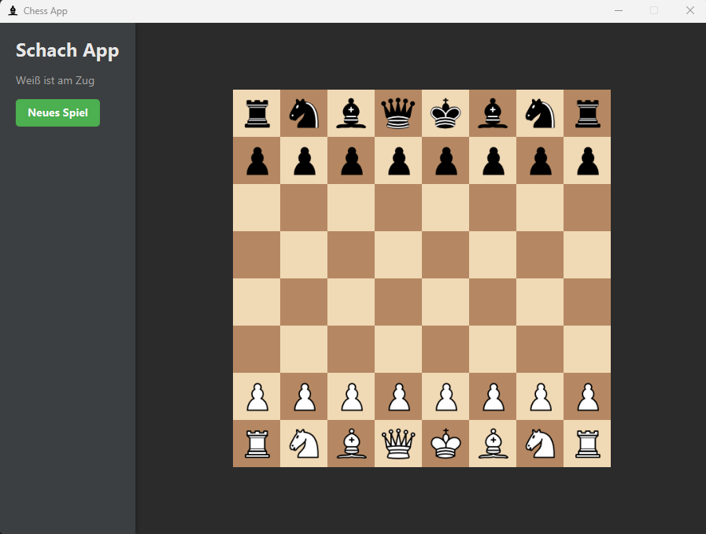
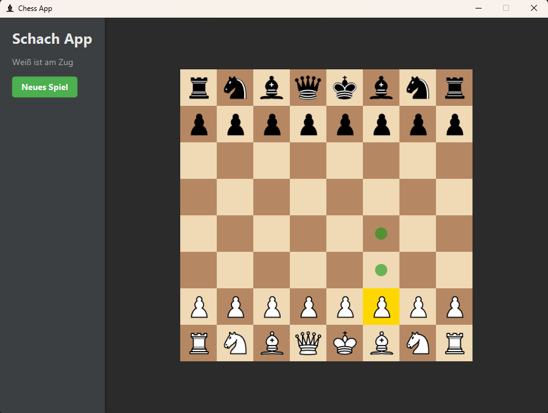
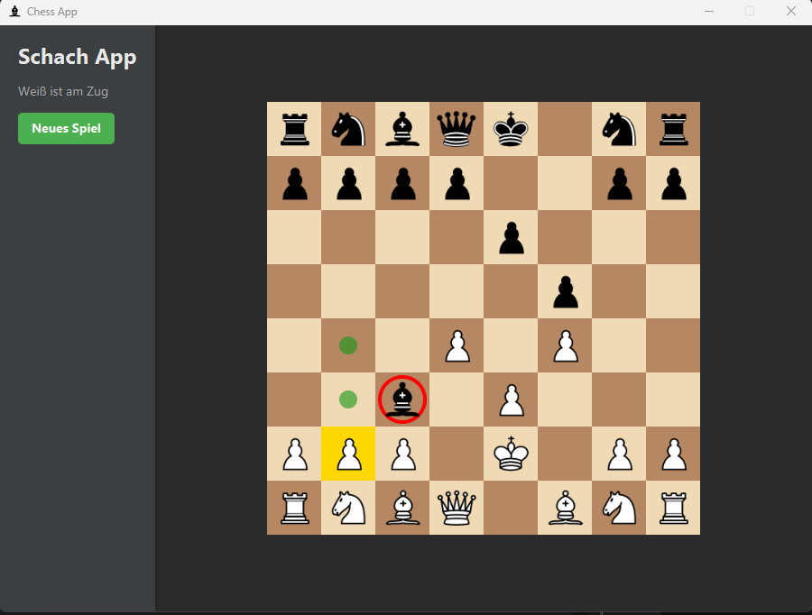
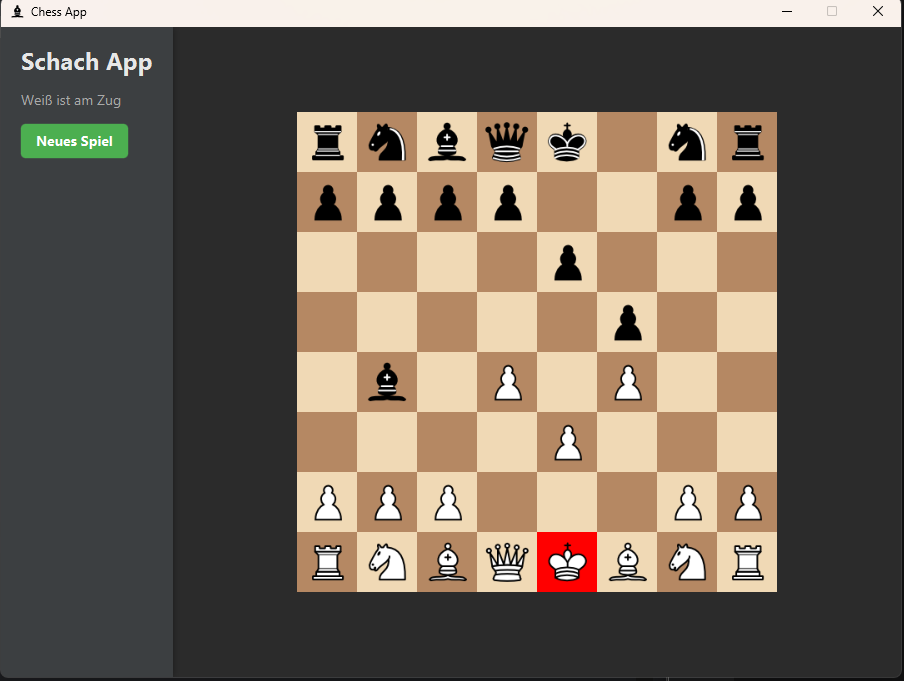

# ♟️ Modern JavaFX Chess Application

   

Eine professionelle Schach-Anwendung mit moderner **Layered Architecture**.
Dieses Projekt demonstriert die Entwicklung einer Desktop-Applikation unter Verwendung von **Clean Code Prinzipien**, Design Patterns (MVC) und externen Bibliotheken zur Logik-Validierung.

## 📸 Galerie & Features

Hier ein Einblick in die Benutzeroberfläche und die visuellen Hilfen für den Spieler:

<table>
  <tr>
    <td align="center">
      
      <br />
      <strong>🌑 Modern Dark Mode</strong><br/>
      Clean UI Design mit CSS-Styling für angenehmes Spielen.
    </td>
    <td align="center">
      
      <br />
      <strong>🟢 Move Highlighting</strong><br/>
      Visuelle Unterstützung: Zeigt alle legalen Züge für die gewählte Figur.
    </td>
  </tr>
  <tr>
    <td align="center">
      
      <br />
      <strong>🔴 Angriffs-Indikatoren</strong><br/>
      Gegnerische Figuren werden rot umrandet, wenn sie geschlagen werden können.
    </td>
    <td align="center">
      
      <br />
      <strong>⚠️ Schach-Warnung</strong><br/>
      Der König leuchtet rot auf, sobald er im Schach steht.
    </td>
  </tr>
</table>

## 🚀 Funktionalitäten

* **Vollständiges Regelwerk:** Unterstützt alle Schachregeln (inkl. Rochade, En Passant, Bauernumwandlung) durch Integration der `chesslib`.
* **Intelligentes UI:**
    * Farbliche Markierung des ausgewählten Feldes (Gold).
    * Dynamische Berechnung möglicher Züge.
    * Sperrung des Bretts bei Spielende (Matt/Remis).
* **Spielstatus:** Erkennung von Schachmatt, Patt und Remis mit entsprechenden Popups.
* **PGN-Support:** Architektur vorbereitet für das Laden und Speichern von Partien (Portable Game Notation).

## 🛠️ Tech Stack & Tools

* **Sprache:** Java 21 (LTS)
* **GUI Framework:** JavaFX (mit FXML & CSS Trennung)
* **Build Tool:** Maven
* **Logic Engine:** [Chesslib](https://github.com/bhlangonijr/chesslib) (Wrapper-Integration)
* **Testing:** JUnit 5
* **CI/CD:** GitHub Actions (Automatisierte Builds & Tests)

## 🏗️ Architektur (MVC)

Das Projekt folgt streng einer **Layered Architecture**, um Wartbarkeit und Erweiterbarkeit zu garantieren:

1.  **Presentation Layer (`de...gui`):**
    * Verwaltet die JavaFX-Ansichten (`.fxml`) und Styles (`.css`).
    * `GameController` verarbeitet User-Inputs und aktualisiert das Board visuell.
2.  **Domain Layer (`de...logic`):**
    * `ChessEngine`: Ein Wrapper um die externe Bibliothek. Kapselt die Regeln und den Spielzustand.
    * Trennt die Logik strikt von der GUI (keine JavaFX-Abhängigkeiten in der Logik!).
3.  **Data Layer (`de...data`):**
    * Vorbereitet für File-IO (PGN Import/Export).

## 📦 Installation & Start

1.  **Repository klonen:**
    ```bash
    git clone [https://github.com/DEIN-USERNAME/java-chess-fx.git](https://github.com/DEIN-USERNAME/java-chess-fx.git)
    ```
2.  **Projekt bauen (Maven):**
    ```bash
    mvn clean install
    ```
3.  **Starten:**
    Führen Sie die Klasse `de.obaialbek.chess.gui.Launcher` aus.

---
*Erstellt von Obai Albek.*
